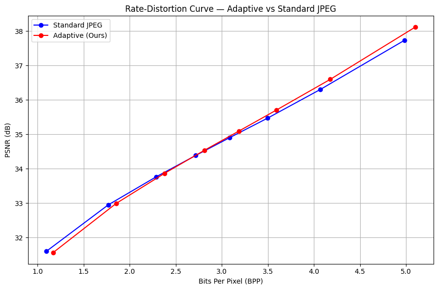
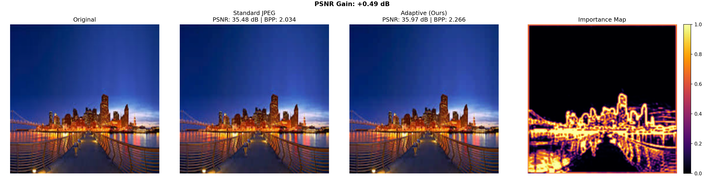

#   Importance-Guided Adaptive Image Compression 

> Deep learning–based adaptive JPEG compression using spatial importance maps to allocate bits where they matter most.

[](https://python.org)
[](https://pytorch.org)
[](LICENSE)
[]()

---

## Overview

This project explores a deep learning–based approach to adaptive image compression using a U-Net model to predict spatial importance maps. These maps guide JPEG quantization, allowing visually important regions to be preserved at higher quality while compressing less critical areas more aggressively.

The result: more bits go to edges and textures that the eye cares about, fewer bits go to smooth or homogeneous regions.

---

## How It Works

```
HR + LR Images (6-ch input)
        │
        ▼
Extract 96×96 patches — stride 48, capped at 30k per dataset
        │
        ▼
U-Net → single-channel importance map
        │
        ▼
normalize_importance() — rescales map to a stable [0,1] range
        │
        ▼
process_image_torch() — differentiable DCT compression
  scales quantization table per 8×8 block by importance
        │
        ▼
Loss = distortion (MSE) + edge + sparsity + contrast
                        + improvement over standard JPEG
        │
  ──────────── evaluation ────────────
        │
        ▼
process_image_bitrate_neutral() — numpy DCT, no gradients
  applies learned importance map at matched bitrate
        │
        ▼
PSNR · SSIM · BPP
```

The model predicts an importance map from paired high- and low-resolution inputs, which is used to adapt JPEG quantization at the block level. During training, a differentiable compression pipeline allows the model to optimize reconstruction quality while encouraging efficient bit allocation. At evaluation time, the learned importance map is applied in a standard (non-differentiable) compression setting to measure real performance using PSNR, SSIM, and bitrate.

---

## Results


### Overall Performance at Q=40

| Method | RMSE ↓ | BPP ↓ | PSNR ↑ |
|--------|--------|-------|--------|
| Standard JPEG | 5.156 | 2.717 | 34.38 dB |
| **Ours (Adaptive)** | **4.716** | 2.811 | **34.53 dB** |

The adaptive method achieves **+0.15 dB PSNR** at a comparable bitrate.

### Rate–Distortion Curve



Adaptive compression consistently outperforms standard JPEG across all quality levels, with gains that grow at higher quality settings:

| Quality | PSNR Gain |
|---------|-----------|
| Q=40 | +0.15 dB |
| Q=80 | +0.38 dB |

### Perceptual Quality (SSIM)

SSIM is equivalent between methods (0.9172 both). 
The method improves PSNR without degrading structural similarity.

### Visual Comparison



Standard JPEG introduces uniform blocking artifacts. The adaptive method preserves edges and fine textures by concentrating quantization budget in high-frequency regions.

### Per-Image Analysis

- **80 of 100 images** show positive PSNR gains at Q=40
- **Typical improvement**: +0.1 to +0.5 dB
- **Maximum improvement**: +1.54 dB (image 64: 46.57 vs 45.03)
- **20 images show minor regressions**, averaging -0.08 dB
- Gains increase consistently at higher quality settings

---

## What the Importance Map Learns

The model learns to focus bits on:
- Sharp edges and object boundaries
- High-frequency textures 
- Semantically salient regions

Smooth, homogeneous regions receive coarser quantization with minimal perceptual impact.

---

## Project Structure

```
image-compression-importance/
notebooks/
├── train_model.ipynb        # Training, evaluation, RD curve
├── test_model.ipynb         # Importance map analysis and visualization
├── compression_engine.ipynb # Full compression pipeline and metrics
├── src/
│   ├── model.py                        # U-Net architecture
│   ├── compression_utils.py            # DCT-based adaptive JPEG compression
├── results/
│   ├── comparison.png                  # Visual side-by-side comparison
│   ├── rd_curve_final.png              # Rate-distortion plot
├── models/
│   └── final_model.pth                # Pretrained weights
├── LICENSE                            # MIT License
├── README.md
└── requirements.txt
```

---

## Setup

```bash
git clone https://github.com/your-username/image-compression-importance.git
cd image-compression-importance
pip install -r requirements.txt
```

## Dataset

Due to size constraints, the dataset is not included in this repository.

Download it from:

- HR images: [Download HR](https://drive.google.com/file/d/1qkXi3MIVw0mxQyFKVDr-p7zMJdhN5GSd/view?usp=sharing)
- LR images: [Download LR](https://drive.google.com/file/d/1NEQ8Er8gYUeJV3ADRws_wQ1rCU_PdJh0/view?usp=sharing)

### Format

- `hr_images.npy`: shape (N, H, W, 3)
- `lr_images.npy`: shape (N, H, W, 3)

### Usage

After downloading, place the files in the project root directory:

```
image-compression-importance/
├── hr_images.npy
├── lr_images.npy
```

Then open `notebooks/train_model.ipynb` to train or evaluate the model.

---

## Future Work

- [ ] BD-rate evaluation against standard JPEG benchmarks
- [ ] Generalization testing across diverse image domains  
- [ ] Perceptual loss integration (LPIPS)
- [ ] Extension to video keyframe compression

---

## Summary

This project demonstrates that **importance-guided quantization consistently improves compression quality over standard JPEG**. By combining a U-Net importance predictor with classical DCT-based compression, the system learns to allocate bits more efficiently — achieving better reconstruction of visually important regions without requiring a full learned codec.

It bridges classical image compression and modern deep learning in a lightweight, interpretable way.
