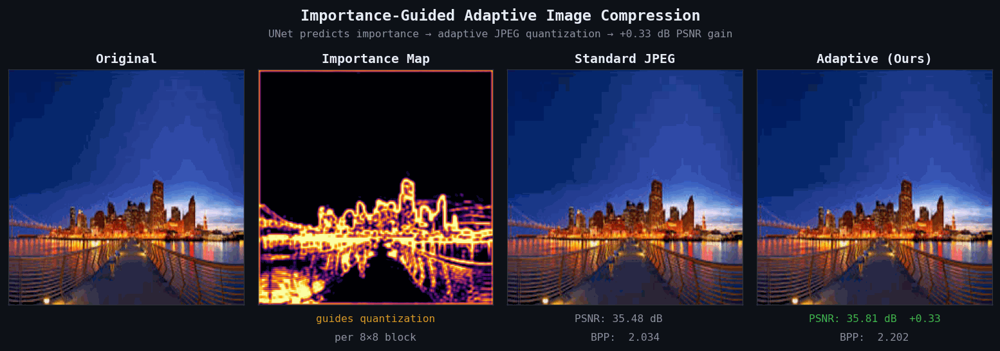
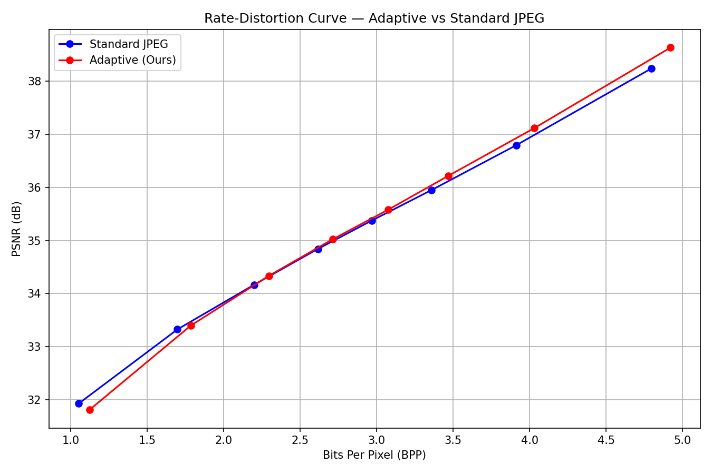
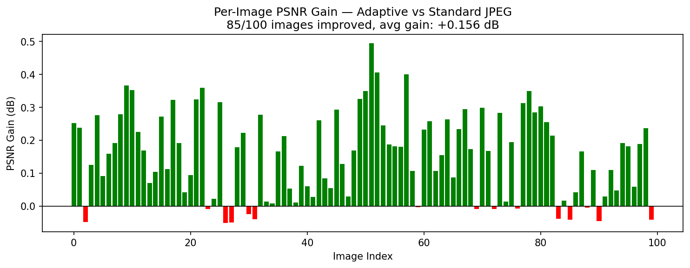
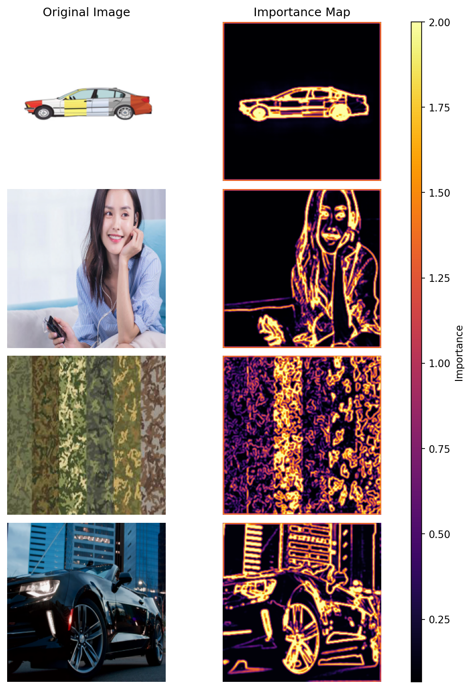

#   Importance-Guided Adaptive Image Compression 

> A deep learning pipeline that learns *where* an image matters — then compresses smarter.

[](https://python.org)
[](https://pytorch.org)
[](LICENSE)
[]()
[]()

---



---

## Overview

A U-Net is trained to predict a spatial **importance map** from paired HR/LR image inputs. This map guides block-level JPEG quantization — important regions (edges, object boundaries, fine textures) receive finer quantization and more bits. Flat, smooth regions are compressed harder. The result is better reconstruction quality at comparable bitrates, with no change to the JPEG format itself.

The result: more bits go to edges and textures that the eye cares about, fewer bits go to smooth or homogeneous regions.

---

## How It Works

```
HR + LR images  →  U-Net  →  importance map (256×256)
                                     │
                        normalize and redistribute
                                     │
                   adaptive DCT quantization per 8×8 block
                                     │
                              PSNR · SSIM · BPP
```

The model predicts an importance map from paired high and low resolution inputs, which is used to adapt JPEG quantization at the block level. During training, a differentiable compression pipeline allows the model to optimize reconstruction quality while encouraging efficient bit allocation. At evaluation time, the learned importance map is applied in a standard (non-differentiable) compression setting to measure real performance using PSNR, SSIM, and bitrate.

---

## Results

### Overall Performance — 137 test images, Q=40

| Method | RMSE ↓ | BPP | PSNR ↑ |
|--------|--------|-----|--------|
| Standard JPEG | 4.855 | 2.728 | 34.41 dB |
| **Adaptive (Ours)** | **4.778** | 2.811 | **34.55 dB** |

**+0.14 dB PSNR** at comparable bitrate, validated across 137 held-out test images.

### Rate–Distortion Curve



PSNR gains grow consistently with quality level:

| Quality | PSNR Gain |
|---------|-----------|
| Q=20 | +0.07 dB |
| Q=40 | +0.17 dB |
| Q=60 | +0.24 dB |
| Q=80 | +0.37 dB |

### Visual Comparison


### Per-Image Analysis — Q=40, 137 images

- **85 of 100 evaluated images** show positive PSNR gains
- Average gain: **+0.14 dB**, maximum: **+0.49 dB**
- Compression ratios: **21x** at Q=10, **9x** at Q=40, **5x** at Q=80
- Minor regression at Q=10 (−0.11 dB) — noted as a known limitation

<p align="center">
  
</p>

### SSIM

SSIM is equivalent between methods (0.9255 adaptive vs 0.9256 standard). The method improves pixel-level fidelity without degrading structural similarity.

<p align="center">
  
</p>

---

## What the Importance Map Learns

<p align="center">
  
</p>

The model learns to preserve:
- Sharp edges and object boundaries
- High-frequency textures and fine structural detail
- Semantically salient regions — vehicles, faces, lights, text

Flat skies, smooth backgrounds, and uniform surfaces are compressed harder with minimal perceptual impact. The city skyline demo above shows this clearly: sky is dark (low importance), buildings and bridge railings are bright (high importance, fine quantization).

<p align="center">
  
</p>

---

## Project Structure

```
image-compression-importance/
├── notebooks/
│   ├── 01_train_model.ipynb         # Data prep, training, RD evaluation
│   ├── 02_test_model.ipynb          # Model validation, importance map analysis
│   └── 03_compression_engine.ipynb  # Full compression pipeline and benchmarks
├── src/
│   └── compression_utils.py         # DCT-based adaptive JPEG compression
├── results/
│   ├── plots/                         # Visual results
│   │   ├── comparison.png             # Compression comparison
│   │   ├── importance_grid.png        # Importance maps
│   │   ├── per_image_rd.png           # Per-image RD curves
│   │   ├── psnr_gain_bar.png          # PSNR gains
│   │   ├── rd_curve_final.png         # RD curve
│   │   ├── scatter_test.png           # RMSE vs BPP
│   │   └── training_convergence.png   # Loss curves
│   │
│   ├── gifs/                          # Animations
│   │   ├── demo_final.gif             # Full demo
│   │   └── focus_only.gif             # Focus visualization
│   │
│   └── metrics/                       # Numerical results
│       ├── compression_engine_results.json
│       ├── test_results.json
│       └── compression_results.csv
├── models/
│   └── best_model.pth               # Pretrained weights (see Releases)
├── LICENSE
├── README.md
└── requirements.txt
```

---

## Setup

```bash
git clone https://github.com/your-username/image-compression-importance.git
cd image-compression-importance
pip install -r requirements.txt
```

**Dependencies:** `torch torchvision numpy opencv-python matplotlib tqdm pytorch-msssim imageio`

## Dataset

Due to size constraints, the dataset is not included in this repository.

Download it from:

- HR images: [Download HR](https://drive.google.com/file/d/1qkXi3MIVw0mxQyFKVDr-p7zMJdhN5GSd/view?usp=sharing)
- LR images: [Download LR](https://drive.google.com/file/d/1NEQ8Er8gYUeJV3ADRws_wQ1rCU_PdJh0/view?usp=sharing)

Both files are shape `(N, 256, 256, 3)`, uint8. Place in project root, then run `01_train_model.ipynb`.

---

## Limitations

- Minor PSNR regression at Q=10 (−0.11 dB) — importance redistribution is insufficient at very aggressive compression
- Adaptive BPP is slightly above standard at equivalent quality settings due to imperfect bitrate-neutral normalization

---

## Future Work

- [ ] BD-rate evaluation against standard JPEG benchmarks
- [ ] Generalization testing across diverse image domains  
- [ ] Perceptual loss integration (LPIPS)
- [ ] Extension to video keyframe compression

---

## Summary

This project demonstrates that a U-Net trained with a differentiable DCT compression pipeline can learn to redistribute quantization budget intelligently — achieving consistent PSNR improvements over standard JPEG from Q=20 to Q=80, validated on 137 test images. It bridges classical image compression and modern deep learning without requiring a full learned entropy model.

